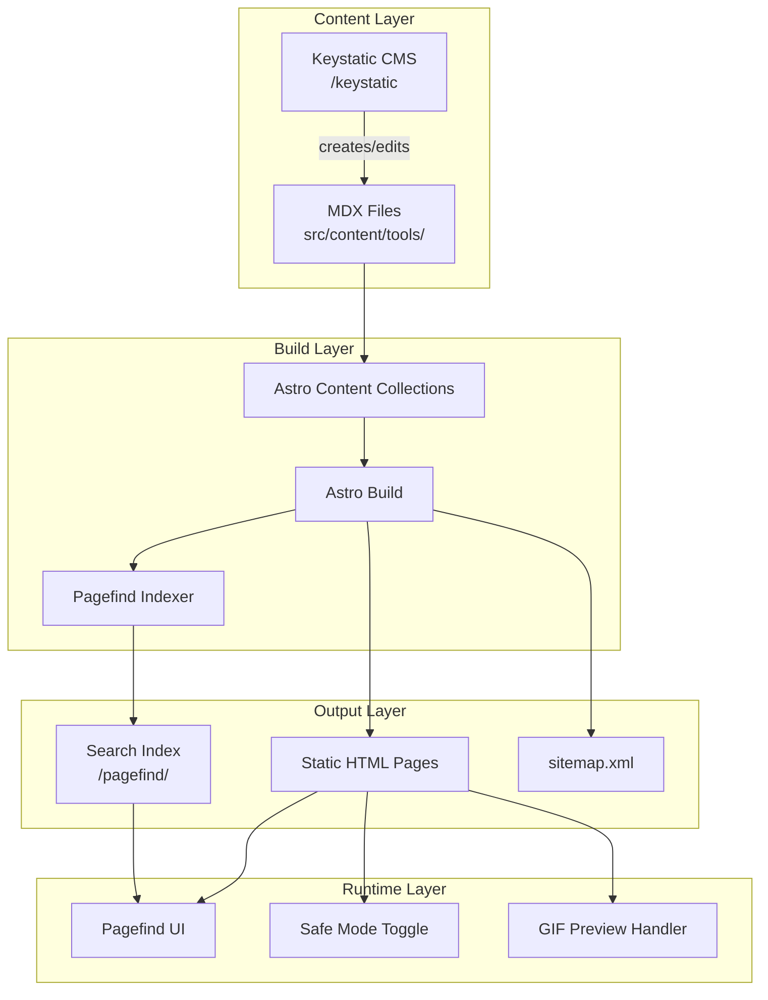

# Design Document: AI Catalog CIS

## Overview

AI Catalog CIS — статический сайт-каталог AI-сервисов для ролеплея и генерации 18+ контента, ориентированный на русскоязычную аудиторию СНГ. Архитектура построена на принципах Jamstack: контент хранится в MDX-файлах, управляется через Keystatic CMS, сайт генерируется Astro в статический HTML, поиск реализован через Pagefind.

Дизайн основан на IDS (Intuition Design System) с адаптацией компонентов под задачи каталога.

## Architecture



### Технологический стек

| Компонент | Технология | Назначение |
|-----------|------------|------------|
| Framework | Astro 5 | SSG, Content Collections, Islands |
| CMS | Keystatic | Файловая админка, MDX-редактор |
| Design System | IDS | Компоненты, типографика, цвета |
| Search | Pagefind | Статический поиск с фильтрами |
| Hosting | Vercel | CI/CD, Edge CDN |
| Analytics | Yandex Metrica | Аналитика для РУ |

## Components and Interfaces

### Структура проекта

```
ai-catalog-cis/
├── keystatic.config.ts          # Схема контента для CMS
├── astro.config.mjs             # Конфигурация Astro
├── public/
│   ├── images/tools/            # Изображения сервисов
│   └── pagefind/                # Поисковый индекс (генерируется)
├── src/
│   ├── content/
│   │   ├── config.ts            # Схема Content Collections
│   │   └── tools/               # MDX-файлы сервисов
│   ├── components/
│   │   ├── ids/                 # Компоненты IDS (копия)
│   │   ├── ToolCard.astro       # Карточка сервиса
│   │   ├── ToolGrid.astro       # Сетка карточек
│   │   ├── TagFilter.astro      # Фильтр по тегам
│   │   ├── SearchWidget.astro   # Виджет Pagefind
│   │   ├── SafeModeToggle.astro # Переключатель Safe Mode
│   │   ├── PaymentGuide.astro   # Блок гайда по оплате
│   │   └── RelatedTools.astro   # Похожие сервисы
│   ├── layouts/
│   │   ├── BaseLayout.astro     # Базовый layout с SEO
│   │   └── ToolLayout.astro     # Layout страницы сервиса
│   └── pages/
│       ├── index.astro          # Главная страница
│       ├── telegram-bots.astro  # Раздел Telegram-ботов
│       └── tool/
│           └── [slug].astro     # Динамическая страница сервиса
└── package.json
```

### Компоненты

#### ToolCard.astro
Карточка сервиса в сетке каталога. Использует IDS `Rounded` для скругления и `Sleepy` для анимации появления.

```typescript
interface ToolCardProps {
  slug: string;
  title: string;
  shortDescription: string;
  coverImage: string;
  gifPreview?: string;      // GIF для hover-эффекта
  priceModel: 'free' | 'freemium' | 'paid';
  tags: string[];
  isNsfw: boolean;
  rating?: number;
}
```

Поведение:
- При наведении: если есть `gifPreview`, заменяет статичное изображение на GIF
- При `isNsfw: true` и включённом Safe Mode: применяет CSS `filter: blur(20px)`
- Отображает бейдж цены (Бесплатно / Freemium / Платно)
- Клик ведёт на `/tool/{slug}`

#### ToolGrid.astro
Сетка карточек на основе IDS `Sequence`. Адаптивная: 4 колонки на десктопе, 2 на мобильных.

```typescript
interface ToolGridProps {
  tools: ToolCardProps[];
  columns?: 'S' | 'M' | 'L';  // S=6, M=4, L=3
}
```

#### TagFilter.astro
Компонент фильтрации по тегам. Использует IDS стилизацию кнопок.

```typescript
interface TagFilterProps {
  tags: Tag[];
  selectedTags: string[];
  onTagToggle: (tag: string) => void;
}

interface Tag {
  id: string;
  label: string;
  category: 'type' | 'language' | 'payment' | 'access';
}
```

Категории тегов:
- **type**: Chatbot, Image Gen, Video, Telegram Bot
- **language**: Понимает русский
- **payment**: Карты РФ, Крипто, Бесплатно
- **access**: Без VPN

#### SearchWidget.astro
Обёртка над Pagefind UI с кастомной стилизацией под IDS.

```typescript
interface SearchWidgetProps {
  placeholder?: string;
  showFilters?: boolean;
}
```

#### SafeModeToggle.astro
Переключатель Safe Mode в хедере.

```typescript
interface SafeModeToggleProps {
  defaultEnabled?: boolean;
}
```

Логика:
- Сохраняет состояние в `localStorage.safeMode`
- При включении добавляет класс `safe-mode` на `<body>`
- CSS правило: `.safe-mode .nsfw-image { filter: blur(20px); }`

#### PaymentGuide.astro
Блок с инструкцией по оплате для сервисов без поддержки карт РФ.

```typescript
interface PaymentGuideProps {
  acceptsRussianCards: boolean;
  paymentMethods: string[];
}
```

## Data Models

### Tool Schema (Content Collection)

```typescript
// src/content/config.ts
import { defineCollection, z } from 'astro:content';

const toolsCollection = defineCollection({
  type: 'content',
  schema: z.object({
    title: z.string().min(1).max(100),
    shortDescription: z.string().min(10).max(200),
    coverImage: z.string(),
    gifPreview: z.string().optional(),
    tags: z.array(z.string()).min(1),
    priceModel: z.enum(['free', 'freemium', 'paid']),
    isNsfw: z.boolean().default(true),
    affiliateLink: z.string().url(),
    rating: z.number().min(0).max(5).optional(),
    acceptsRussianCards: z.boolean().default(false),
    requiresVpn: z.boolean().default(true),
    supportsRussian: z.boolean().default(false),
    paymentMethods: z.array(z.string()).optional(),
    faq: z.array(z.object({
      question: z.string(),
      answer: z.string()
    })).optional(),
    publishedAt: z.date(),
    updatedAt: z.date().optional()
  })
});

export const collections = { tools: toolsCollection };
```

### Keystatic Schema

```typescript
// keystatic.config.ts
import { config, fields, collection } from '@keystatic/core';

export default config({
  storage: { kind: 'local' },
  collections: {
    tools: collection({
      label: 'AI Сервисы',
      slugField: 'title',
      path: 'src/content/tools/*',
      format: { contentField: 'content' },
      schema: {
        title: fields.slug({ name: { label: 'Название' } }),
        shortDescription: fields.text({ 
          label: 'Краткое описание',
          validation: { length: { min: 10, max: 200 } }
        }),
        coverImage: fields.image({
          label: 'Обложка',
          directory: 'public/images/tools',
          publicPath: '/images/tools/'
        }),
        gifPreview: fields.image({
          label: 'GIF превью (опционально)',
          directory: 'public/images/tools',
          publicPath: '/images/tools/'
        }),
        tags: fields.multiselect({
          label: 'Теги',
          options: [
            { label: 'Чат-бот', value: 'chatbot' },
            { label: 'Генерация изображений', value: 'image-gen' },
            { label: 'Видео', value: 'video' },
            { label: 'Telegram бот', value: 'telegram-bot' },
            { label: 'Понимает русский', value: 'russian' },
            { label: 'Карты РФ', value: 'russian-cards' },
            { label: 'Крипто', value: 'crypto' },
            { label: 'Без VPN', value: 'no-vpn' }
          ]
        }),
        priceModel: fields.select({
          label: 'Модель оплаты',
          options: [
            { label: 'Бесплатно', value: 'free' },
            { label: 'Freemium', value: 'freemium' },
            { label: 'Платно', value: 'paid' }
          ],
          defaultValue: 'freemium'
        }),
        isNsfw: fields.checkbox({ label: 'NSFW контент', defaultValue: true }),
        affiliateLink: fields.url({ label: 'Партнёрская ссылка' }),
        rating: fields.number({ 
          label: 'Рейтинг',
          validation: { min: 0, max: 5 }
        }),
        acceptsRussianCards: fields.checkbox({ 
          label: 'Принимает карты РФ',
          defaultValue: false 
        }),
        requiresVpn: fields.checkbox({ 
          label: 'Требует VPN',
          defaultValue: true 
        }),
        supportsRussian: fields.checkbox({ 
          label: 'Поддержка русского языка',
          defaultValue: false 
        }),
        faq: fields.array(
          fields.object({
            question: fields.text({ label: 'Вопрос' }),
            answer: fields.text({ label: 'Ответ', multiline: true })
          }),
          { label: 'FAQ', itemLabel: props => props.fields.question.value }
        ),
        content: fields.mdx({ label: 'Полное описание' })
      }
    })
  }
});
```

### Tag Model

```typescript
interface Tag {
  id: string;
  label: string;
  labelEn: string;
  category: 'type' | 'language' | 'payment' | 'access';
  icon?: string;
}

const TAGS: Tag[] = [
  { id: 'chatbot', label: 'Чат-бот', labelEn: 'Chatbot', category: 'type' },
  { id: 'image-gen', label: 'Генерация изображений', labelEn: 'Image Gen', category: 'type' },
  { id: 'video', label: 'Видео', labelEn: 'Video', category: 'type' },
  { id: 'telegram-bot', label: 'Telegram бот', labelEn: 'Telegram Bot', category: 'type' },
  { id: 'russian', label: 'Понимает русский', labelEn: 'Russian', category: 'language' },
  { id: 'russian-cards', label: 'Карты РФ', labelEn: 'Russian Cards', category: 'payment' },
  { id: 'crypto', label: 'Крипто', labelEn: 'Crypto', category: 'payment' },
  { id: 'no-vpn', label: 'Без VPN', labelEn: 'No VPN', category: 'access' }
];
```


## Correctness Properties

*A property is a characteristic or behavior that should hold true across all valid executions of a system-essentially, a formal statement about what the system should do. Properties serve as the bridge between human-readable specifications and machine-verifiable correctness guarantees.*

Based on the prework analysis, the following correctness properties have been identified:

### Property 1: Tool sorting by rating

*For any* list of tools with ratings, when displayed on the homepage, the tools SHALL be ordered by rating in descending order (highest first).

**Validates: Requirements 1.1**

### Property 2: Tool card rendering completeness

*For any* valid tool data, the rendered Tool Card SHALL contain: tool name, short description, cover image, price model badge, and at least one tag.

**Validates: Requirements 1.2**

### Property 3: Tag filtering with AND logic

*For any* list of tools and *any* non-empty set of selected tags, the filtered result SHALL contain only tools that have ALL selected tags. When the tag set is empty, all tools SHALL be returned.

**Validates: Requirements 2.1, 2.2, 2.3**

### Property 4: Tool page section completeness

*For any* valid tool data:
- The Tool Page SHALL display full description, cover image, and affiliate link
- IF the tool has FAQ data THEN the page SHALL display all FAQ items
- IF acceptsRussianCards is false THEN the page SHALL display payment guide section
- The page SHALL display related tools that share at least one tag with the current tool

**Validates: Requirements 4.1, 4.2, 4.3, 4.4**

### Property 5: Safe Mode CSS class application

*For any* tool marked as NSFW, when Safe Mode is enabled, the tool's image element SHALL have the blur CSS class applied. When Safe Mode is disabled, the blur class SHALL NOT be present.

**Validates: Requirements 5.1, 5.3**

### Property 6: Safe Mode localStorage round-trip

*For any* Safe Mode state (enabled/disabled), setting the state and then reading it from localStorage SHALL return the same value.

**Validates: Requirements 5.2**

### Property 7: Tool schema validation

*For any* tool data object, IF all required fields are present and valid THEN schema validation SHALL pass. IF any required field is missing or invalid THEN schema validation SHALL fail with a descriptive error.

**Validates: Requirements 6.3, 9.3, 9.4**

### Property 8: SEO meta tags completeness

*For any* Tool Page, the rendered HTML SHALL contain:
- meta title tag with tool name
- meta description tag with short description
- Open Graph tags (og:title, og:description, og:image)
- canonical URL tag

**Validates: Requirements 7.1, 7.4**

### Property 9: Schema.org markup validity

*For any* tool with a rating, the rendered Tool Page SHALL contain valid JSON-LD with Product and AggregateRating schema.org types.

**Validates: Requirements 7.2**

### Property 10: Sitemap completeness

*For any* set of published tools, the generated sitemap.xml SHALL contain URLs for all tool pages.

**Validates: Requirements 7.3**

### Property 11: Telegram bot direct link

*For any* tool tagged as "telegram-bot", the rendered Tool Card SHALL display a direct link to the Telegram bot.

**Validates: Requirements 8.2**

## Error Handling

### Content Validation Errors

| Error Type | Handling Strategy |
|------------|-------------------|
| Missing required field | Build fails with error message indicating field and file |
| Invalid URL format | Build fails with validation error |
| Invalid rating range | Build fails, rating must be 0-5 |
| Missing cover image | Build fails, image is required |
| Empty tags array | Build fails, at least one tag required |

### Runtime Errors

| Error Type | Handling Strategy |
|------------|-------------------|
| Image load failure | Display placeholder image with alt text |
| localStorage unavailable | Safe Mode defaults to disabled, no persistence |
| Pagefind index missing | Display "Search unavailable" message |

### Graceful Degradation

- If GIF preview fails to load, static image remains visible
- If Pagefind fails, tag filtering still works (client-side)
- If schema.org JSON-LD is malformed, page still renders (SEO degraded)

## Testing Strategy

### Property-Based Testing Library

**Library**: fast-check (TypeScript)

fast-check is chosen because:
- Native TypeScript support
- Excellent shrinking for finding minimal failing cases
- Built-in arbitraries for common types
- Good integration with Vitest

### Test Structure

```
src/
├── __tests__/
│   ├── properties/
│   │   ├── sorting.property.test.ts      # Property 1
│   │   ├── toolCard.property.test.ts     # Property 2
│   │   ├── filtering.property.test.ts    # Property 3
│   │   ├── toolPage.property.test.ts     # Property 4
│   │   ├── safeMode.property.test.ts     # Properties 5, 6
│   │   ├── schema.property.test.ts       # Property 7
│   │   ├── seo.property.test.ts          # Properties 8, 9
│   │   ├── sitemap.property.test.ts      # Property 10
│   │   └── telegram.property.test.ts     # Property 11
│   └── unit/
│       ├── components/
│       └── utils/
```

### Property Test Configuration

Each property-based test MUST:
- Run a minimum of 100 iterations
- Include a comment referencing the correctness property: `// **Feature: ai-catalog-cis, Property {N}: {description}**`
- Use smart generators that constrain to valid input space

### Generators

```typescript
// Tool data generator
const toolArbitrary = fc.record({
  title: fc.string({ minLength: 1, maxLength: 100 }),
  shortDescription: fc.string({ minLength: 10, maxLength: 200 }),
  coverImage: fc.constant('/images/tools/placeholder.jpg'),
  tags: fc.array(
    fc.constantFrom('chatbot', 'image-gen', 'video', 'telegram-bot', 'russian', 'russian-cards', 'crypto', 'no-vpn'),
    { minLength: 1, maxLength: 5 }
  ),
  priceModel: fc.constantFrom('free', 'freemium', 'paid'),
  isNsfw: fc.boolean(),
  affiliateLink: fc.webUrl(),
  rating: fc.option(fc.float({ min: 0, max: 5 })),
  acceptsRussianCards: fc.boolean(),
  requiresVpn: fc.boolean(),
  supportsRussian: fc.boolean()
});

// Tag set generator
const tagSetArbitrary = fc.uniqueArray(
  fc.constantFrom('chatbot', 'image-gen', 'video', 'telegram-bot', 'russian', 'russian-cards', 'crypto', 'no-vpn'),
  { minLength: 0, maxLength: 4 }
);
```

### Unit Tests

Unit tests cover:
- Component rendering with specific edge cases
- Utility function behavior
- Integration with Astro Content Collections

### Test Commands

```bash
# Run all tests
npm run test

# Run property tests only
npm run test:properties

# Run with coverage
npm run test:coverage
```

